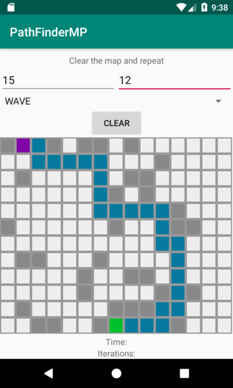
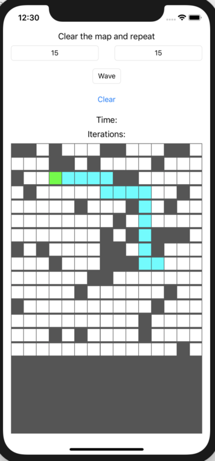

# PathFinderMP

Simple experimental multiplatform project using Kotlin Multiplatform.

The application implements algorithms for shortest path finding in a two-dimensional map (maze).

## Project modules

The project consists of the following submodules:

### pathfinderlib

Common module that contains multiplatform (common, ios, jvm) implementations of the core application logic and presentation layer for the single screen.

The following pathfinding algorithms are currently implemented:

- Lee algorithm (Wave algorithm)
- Dijkstra's algorithm

### Platform submodules

The application is implemented for the following platforms:

- **androidApp** - Android implementation of the application. Uses the jvm implementation of **pathfinderlib** submodule.

- **iosApp** - iOS implementation of the application. Uses the ios implementation of **pathfinderlib** submodule.

- **linuxApp** - implementation of the app for native **linux_x64** platform using Kotlin/Native. Uses the native linux implementation of **pathfinderlib** submodule. The **ncurses** library is used for the GUI. **cinterop** is used to interact with ncurses library.

- **cliApp** - JVM implementation of the application (for debugging and testing purposes). Uses the jvm implementation of **pathfinderlib** submodule. Console is used for output.

### How to build specific submodule

##### linuxApp

1) Build common **pathfinderlib** module using gradle task `build`.
2) Publish to Maven Local using gradle task `publishToMavenLocal`.
3) Build **linuxApp** module using gradle task `build`.
4) Run `linuxApp/build/exe/main/release/linuxApp.kexe`

##### androidApp

Just run `androidApp` task in Android Studio: 
**Run -> Run -> androidApp**

##### iosApp

Later

## Screenshots

Screenshot for android app:

Screenshot for iOS app:

## Contributors

* [tgrid0](https://github.com/tgrid0)
* [AppoNut](https://github.com/AppoNut/)
* [tetraquark](https://github.com/Tetraquark)