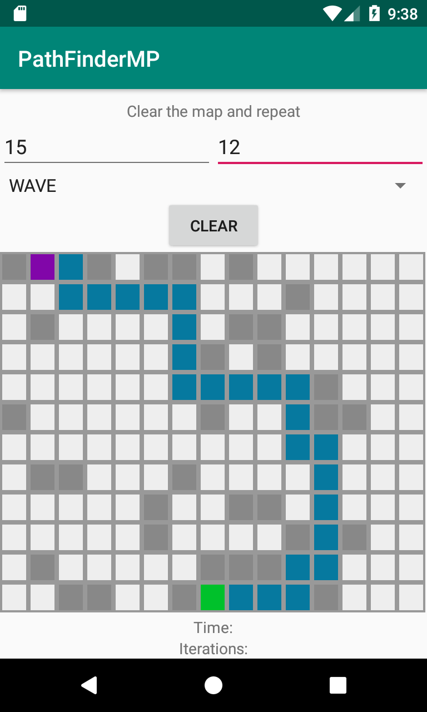

# PathFinderMP

Experimental multiplatform project using Kotlin Multiplatform.

The application implements algorithms for path finding in a two-dimensional map (maze).

### Project modules

The project consists of the following submodules:

##### pathfinderlib

Common module that contains multiplatform (common, ios, jvm) implementations of the core application logic. 

The following pathfinding algorithms are currently implemented:

- Lee algorithm (Wave algorithm)

##### Platform submodules

The application is implemented for the following platforms:

- **androidApp** - Android implementation of the application. Uses the jvm implementation of **pathfinderlib** submodule.

- **cliApp** - JVM implementation of the application (for testing purposes). Uses the jvm implementation of **pathfinderlib** submodule. Console is used for output.

- **iosApp** - iOS implementation of the application. Uses the ios implementation of **pathfinderlib** submodule.

### Contributors

* [tgrid0](https://github.com/tgrid0)
* [tetraquark](https://github.com/Tetraquark)