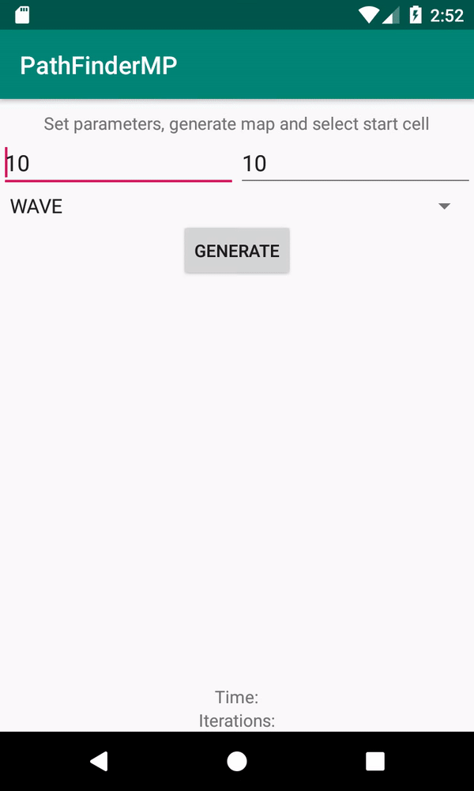
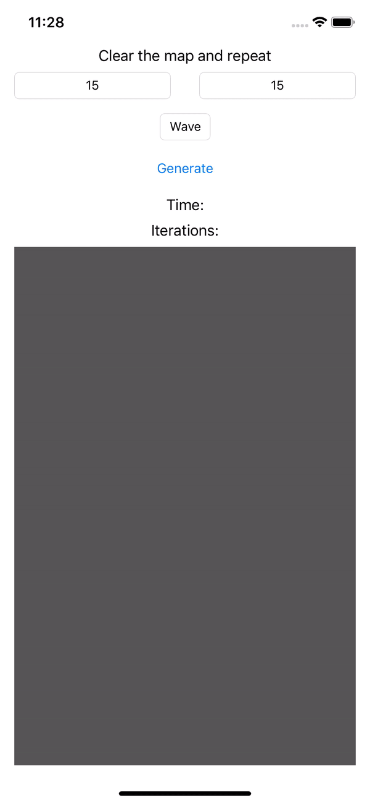
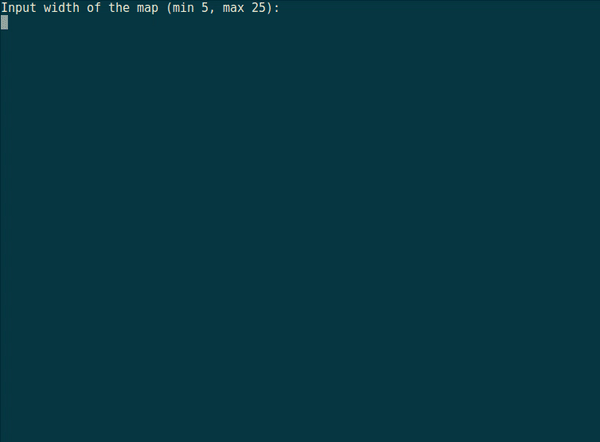

# PathFinderMP

Simple experimental multiplatform project using Kotlin Multiplatform.

The application implements algorithms for shortest path finding in a two-dimensional map (maze).

## Project modules

The project consists of the following submodules:

### pathfinderlib

Common module that contains multiplatform (common, ios, jvm, linux) implementations of the core application logic and presentation layer for the single screen.

The following pathfinding algorithms are currently implemented:

- Lee algorithm (Wave algorithm)
- Dijkstra's algorithm

### Platform submodules

The application is implemented for the following platforms:

- **androidApp** - Android implementation of the application. Uses the jvm implementation of **pathfinderlib** submodule.

- **iosApp** - iOS implementation of the application. Uses the ios implementation of **pathfinderlib** submodule.

- **linuxApp** - implementation of the app for native **linux_x64** platform using Kotlin/Native. Uses the native linux implementation of **pathfinderlib** submodule. The **ncurses** library is used for the GUI. **cinterop** is used to interact with ncurses library.

- **cliApp** - JVM implementation of the application (for debugging and testing purposes). Uses the jvm implementation of **pathfinderlib** submodule. Console is used for output.

## How to build specific submodule

First of all, you need to build the common module and publish it in maven local repo (for **linuxApp** submodule):

```
./gradlew pathfinderlib:build
./gradlew pathfinderlib:publishToMavenLocal
```

Then you can build an app for a specific platform.

##### linuxApp

Install **ncurses**:

```
apt-get install libncurses5-dev
```

Build the app using gradlew:

```
./gradlew linuxapp:build
```

And then just run the executable:

```
./linuxApp/build/exe/main/release/linuxApp.kexe
```

##### iosApp

Open **iosApp** project in Xcode and follow the instructions [here](https://kotlinlang.org/docs/tutorials/native/mpp-ios-android.html#setting-up-xcode).

##### androidApp

Using gradlew:

```
./gradlew androidapp:build
```

Or you can use the Android Studio build tool. 

## Preview

##### Android



##### iOS



##### Linux



## License

All content is licensed under the terms of the MIT open source license.

## Contributors

* [tgrid0](https://github.com/tgrid0)
* [AppoNut](https://github.com/AppoNut/)
* [tetraquark](https://github.com/Tetraquark)